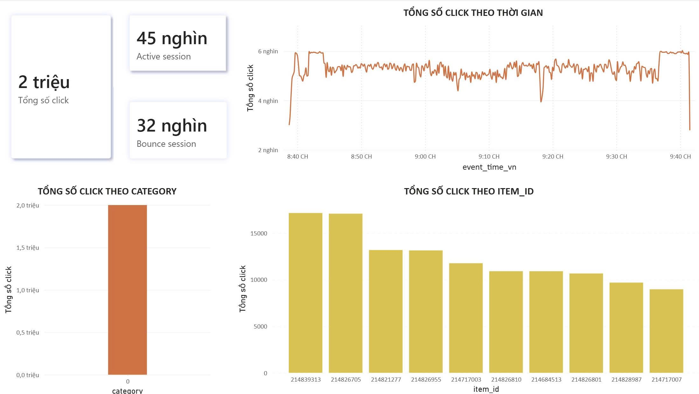
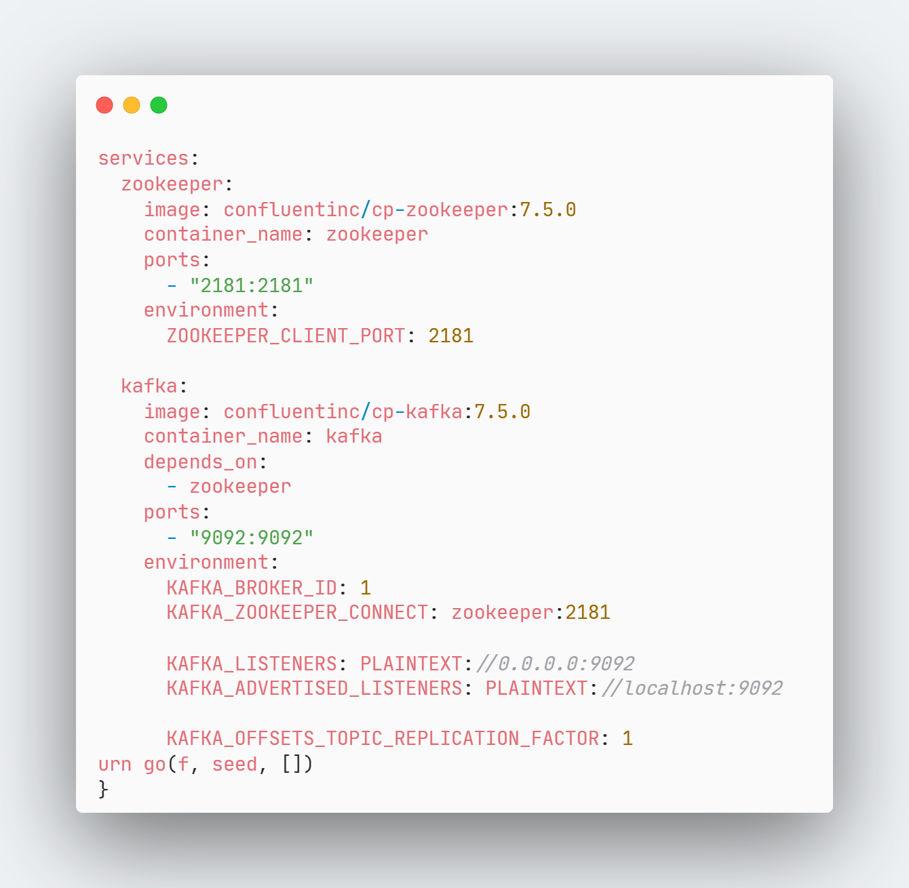
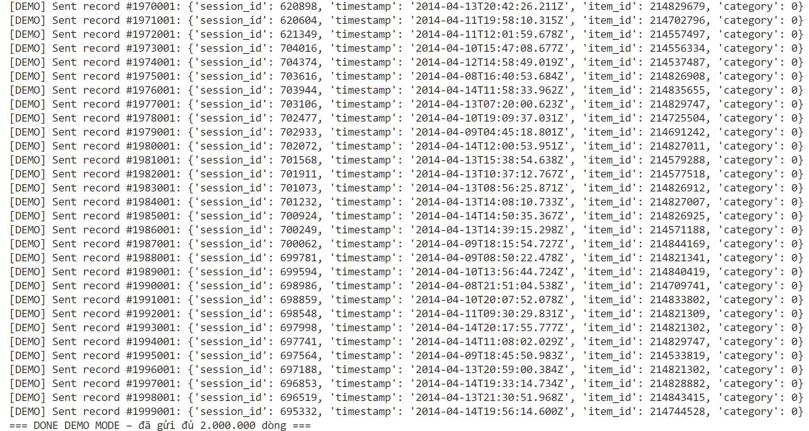
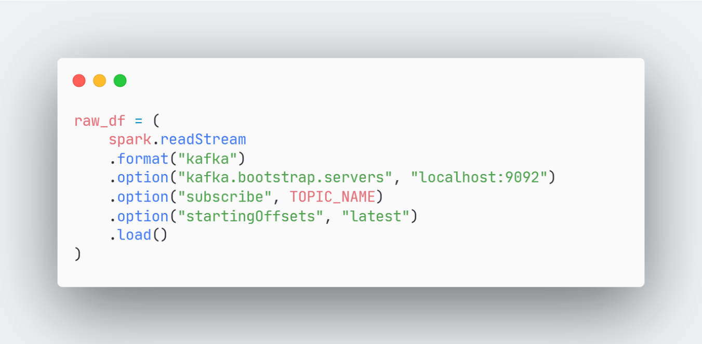
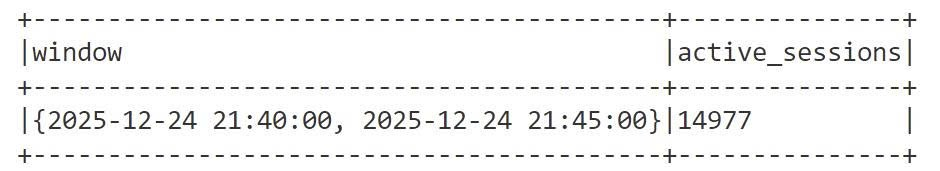
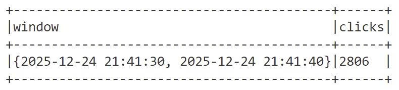
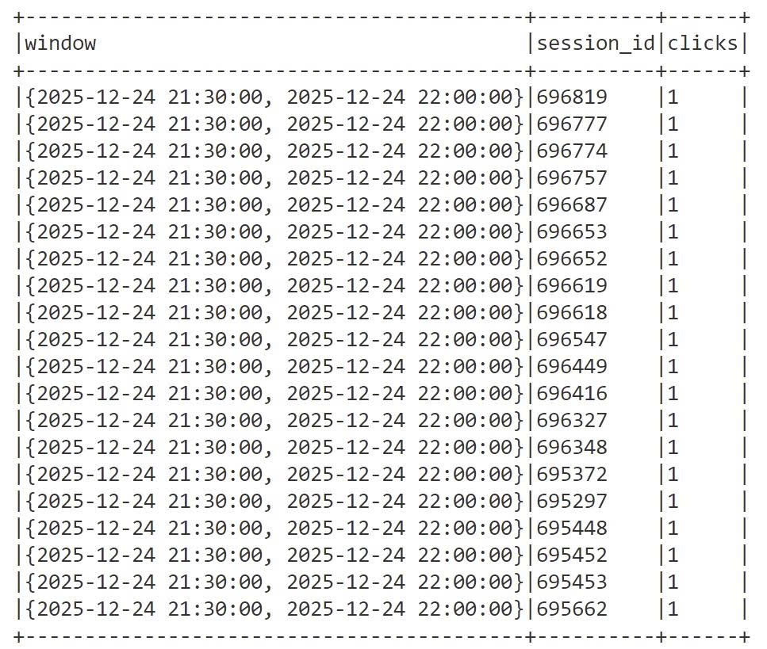

# Real-time E-commerce Clickstream Analytics

Project này xây dựng một pipeline phân tích clickstream thương mại điện tử theo thời gian thực. Hệ thống mô phỏng luồng người dùng click vào sản phẩm, gửi sự kiện vào Kafka, xử lý bằng Spark Structured Streaming, sau đó xuất dữ liệu và các chỉ số phân tích để phục vụ quan sát hành vi người dùng trên dashboard.

## 1. Mục tiêu project

Trong hệ thống thương mại điện tử, mỗi lượt click của người dùng có thể được xem như một sự kiện. Khi số lượng người dùng lớn, dữ liệu clickstream cần được xử lý liên tục thay vì đợi gom thành batch. Project này mô phỏng bài toán đó bằng cách:

- Đọc dữ liệu click từ bộ dữ liệu YooChoose.
- Giả lập luồng dữ liệu real-time bằng Python Kafka Producer.
- Đẩy từng click event vào Kafka topic `clickstream`.
- Dùng Spark Structured Streaming đọc dữ liệu từ Kafka.
- Tính toán các metric gần real-time về sản phẩm, danh mục, session và số lượt click.
- Ghi dữ liệu raw ra Parquet để có thể phân tích hoặc trực quan hóa bằng Power BI.

## 2. Kiến trúc hệ thống

```text
YooChoose click dataset
        |
        v
Python Producer
        |
        v
Kafka topic: clickstream
        |
        v
Spark Structured Streaming
        |
        +--> Real-time metrics on console
        +--> Raw data in Parquet format
        +--> Power BI dashboard
```

Các thành phần chính:

- **Dataset**: file `yoochoose-clicks.dat` chứa lịch sử click của người dùng.
- **Kafka Producer**: đọc file dữ liệu, chuyển từng dòng thành JSON event và gửi vào Kafka.
- **Kafka**: đóng vai trò message broker, nhận và lưu tạm luồng clickstream.
- **Spark Structured Streaming**: đóng vai trò stream consumer, đọc message từ Kafka và xử lý dữ liệu liên tục.
- **Output Parquet**: lưu dữ liệu đã parse để phục vụ phân tích downstream.
- **Power BI**: dashboard trực quan hóa kết quả phân tích.

## 3. Demo kết quả

### 3.1. Dashboard Power BI

Dashboard tổng hợp các chỉ số chính của luồng clickstream: tổng số click, active session, bounce session, xu hướng click theo thời gian, top category và top item.



### 3.2. Kafka chạy bằng Docker Compose

Kafka và Zookeeper được chạy bằng Docker Compose. Cấu hình expose Kafka tại `localhost:9092` để producer và Spark trên máy local có thể kết nối.



### 3.3. Producer gửi dữ liệu vào Kafka

Producer đọc dữ liệu YooChoose, chuyển từng dòng thành JSON event và gửi liên tục vào Kafka topic `clickstream`. Ảnh dưới là log khi producer demo gửi đủ 2.000.000 record.



### 3.4. Spark đọc stream từ Kafka

Spark Structured Streaming kết nối tới Kafka broker `localhost:9092`, subscribe topic `clickstream` và đọc message mới nhất trong stream.



### 3.5. Spark console metrics

Metric active sessions trong cửa sổ 5 phút:



Metric số click trong cửa sổ 10 giây:



Metric bounce sessions, tức các session chỉ có đúng 1 click trong cửa sổ thời gian:



## 4. Cấu trúc thư mục

```text
realtime-clickstream/
|-- assets/
|   `-- demo/
|-- docker/
|   `-- docker-compose.yml
|-- producer/
|   |-- producer_demo.py
|   `-- producer_test.py
|-- spark/
|   `-- spark_streaming.py
|-- dashboard/
|   `-- demo2m.pbix
|-- data/
|   `-- yoochoose-clicks.dat
|-- checkpoint/
|-- output/
|-- check_data.ipynb
|-- .gitignore
`-- README.md
```

Ghi chú: thư mục `data/`, `checkpoint/`, `output/`, file report và môi trường ảo `venv/` không được đưa lên Git.

## 5. Công nghệ sử dụng

- **Python**: viết producer gửi dữ liệu vào Kafka.
- **kafka-python**: thư viện Python để kết nối Kafka.
- **Apache Kafka**: message broker cho luồng clickstream.
- **Apache Spark Structured Streaming**: xử lý stream và tính toán metric.
- **PySpark 3.5.1**: API Spark dùng trong Python.
- **Docker Compose**: chạy Kafka và Zookeeper.
- **Parquet**: định dạng lưu dữ liệu output.
- **Power BI**: xây dựng dashboard phân tích.

## 6. Dữ liệu đầu vào

Project sử dụng bộ dữ liệu YooChoose clickstream. File dữ liệu local cần đặt tại:

```text
data/yoochoose-clicks.dat
```

Mỗi dòng có 4 trường:

```text
session_id,timestamp,item_id,category
```

Ví dụ:

```text
1,2014-04-07T10:51:09.277Z,214536502,0
1,2014-04-07T10:54:09.868Z,214536500,0
2,2014-04-07T13:56:37.614Z,214662742,0
```

Ý nghĩa các trường:

- `session_id`: mã phiên truy cập của người dùng.
- `timestamp`: thời điểm phát sinh click trong dữ liệu gốc.
- `item_id`: mã sản phẩm được click.
- `category`: mã danh mục sản phẩm.

File dữ liệu này có dung lượng lớn nên không được push lên GitHub. Khi clone project về máy khác, cần tự tạo thư mục `data/` và đặt file `yoochoose-clicks.dat` vào đó.

## 7. Mô tả các module chính

### 7.1. Kafka và Zookeeper

File:

```text
docker/docker-compose.yml
```

File này khai báo 2 service:

- `zookeeper`: service điều phối cho Kafka.
- `kafka`: broker Kafka chạy tại `localhost:9092`.

Kafka được cấu hình để producer và Spark trên máy local có thể kết nối thông qua:

```text
localhost:9092
```

### 7.2. Producer demo

File:

```text
producer/producer_demo.py
```

Chức năng:

- Đọc file `data/yoochoose-clicks.dat`.
- Parse từng dòng thành event JSON.
- Gửi event vào Kafka topic `clickstream`.
- Giới hạn tối đa `2_000_000` dòng đầu tiên.
- Sleep `0.001` giây giữa các event, tương đương khoảng 1000 event/giây.

Event gửi vào Kafka có dạng:

```json
{
  "session_id": 1,
  "timestamp": "2014-04-07T10:51:09.277Z",
  "item_id": 214536502,
  "category": 0
}
```

### 7.3. Producer real-time loop

File:

```text
producer/producer_test.py
```

Chức năng:

- Đọc toàn bộ file dữ liệu.
- Gửi từng event vào Kafka topic `clickstream`.
- Sleep `0.01` giây giữa các event, tương đương khoảng 100 event/giây.
- Khi đọc hết file, chờ 2 giây rồi quay lại đọc từ đầu.
- Phù hợp để demo luồng dữ liệu chạy liên tục.

### 7.4. Spark Streaming

File:

```text
spark/spark_streaming.py
```

Spark thực hiện các bước:

1. Tạo `SparkSession` ở chế độ local.
2. Kết nối Kafka topic `clickstream`.
3. Đọc message Kafka dưới dạng stream.
4. Parse JSON thành các cột có schema rõ ràng.
5. Gắn `event_time` bằng `current_timestamp()` để demo window processing theo thời gian chạy thực tế.
6. Ghi raw data ra Parquet.
7. Tính các metric streaming và in ra console.

Schema dữ liệu sau khi parse:

```text
session_id: integer
timestamp: string
item_id: integer
category: integer
event_time: timestamp
```

## 8. Các metric được tính

Spark Structured Streaming đang tính 5 nhóm metric:

### Metric 1: Top Product

Đếm số click theo `item_id` để xác định sản phẩm được quan tâm nhiều nhất.

```text
groupBy(item_id).count()
```

### Metric 2: Active Sessions trong 5 phút

Đếm số session khác nhau trong cửa sổ thời gian 5 phút.

```text
window(event_time, "5 minutes")
approx_count_distinct(session_id)
```

### Metric 3: Clicks per 10 seconds

Đếm tổng số click phát sinh trong mỗi cửa sổ 10 giây.

```text
window(event_time, "10 seconds")
count(*)
```

### Metric 4: Top Category

Đếm số click theo `category` để xác định danh mục được click nhiều.

```text
groupBy(category).count()
```

### Metric 5: Bounce Session

Phát hiện các session chỉ có đúng 1 click trong cửa sổ 30 phút.

```text
window(event_time, "30 minutes"), session_id
count(*) == 1
```


